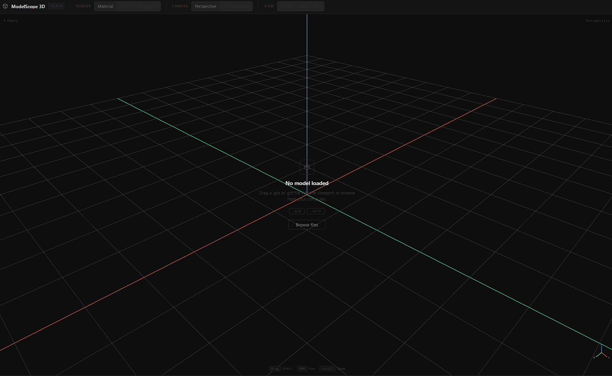
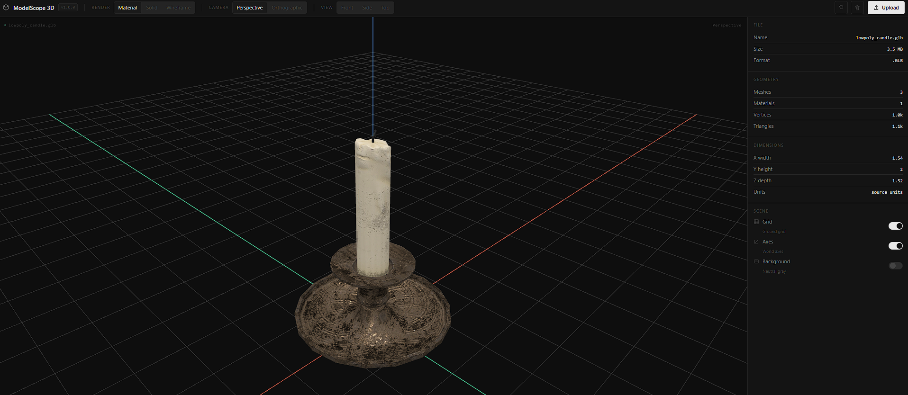
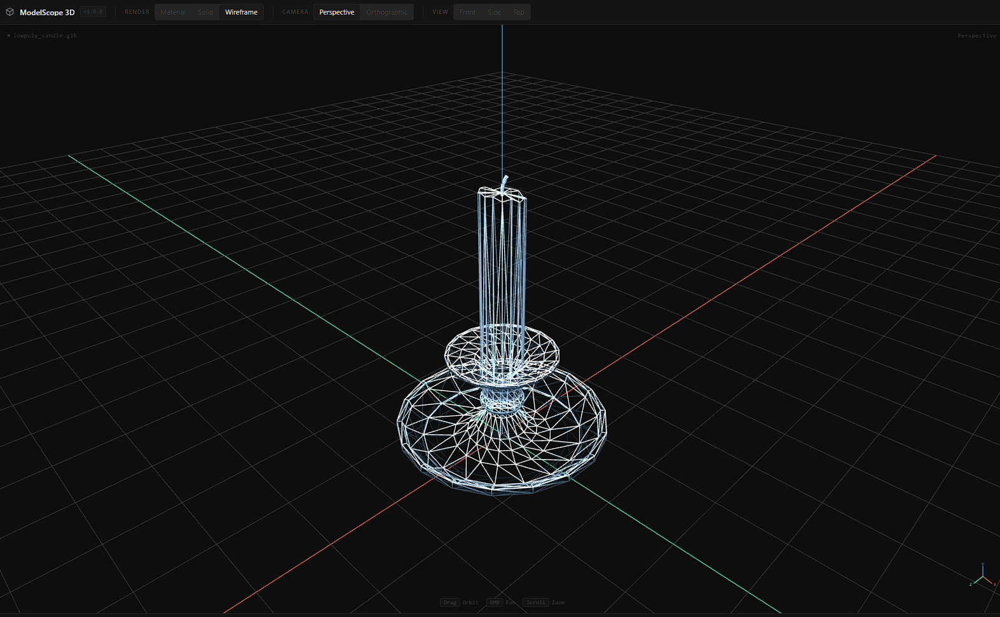

# 3D Model Viewer

A lightweight browser-based 3D model viewer for uploading, viewing, and inspecting `.glb` and `.gltf` files directly in the browser.

## Live Demo

[Open the 3D Model Viewer](https://haider855.github.io/3DModelViewer/)

## What It Does

3D Model Viewer lets users upload a 3D model from their computer and inspect it inside an interactive browser viewport.

The app runs fully client-side. Files are loaded locally in the browser and are not uploaded to a server.

Users can rotate, zoom, pan, switch view modes, inspect model statistics, and clear the scene to load another model.

## Why I Built It

I built this project to create a simple alternative to opening full 3D software just to inspect an exported model.

## Key Features

- Upload `.glb` and `.gltf` files
- Drag and drop model loading
- Client-side file handling with no backend
- Interactive Babylon.js 3D viewport
- Orbit, zoom, and pan camera controls
- Automatic model positioning and camera framing
- Adaptive floor grid based on model size
- Scene axes aligned with the grid floor
- Material, solid, and wireframe view modes
- Perspective and orthographic camera modes
- Front, side, and top fixed camera views
- Reset camera control
- Clear model control
- Unsupported file validation
- Loading, empty, and error states
- Model statistics panel showing:
  - File name
  - File size
  - File format
  - Mesh count
  - Material count
  - Vertex count
  - Triangle count
  - Bounding box dimensions
- Grid, axes, and neutral background toggles

## Screenshots

### Empty State

### Loaded Model

### Wireframe Mode

## Tech Stack

- Vite
- TypeScript
- Babylon.js
- Plain CSS
- GitHub Pages

## What I Learned

This project helped me understand how to build a practical browser-based 3D inspection tool.

Key areas I worked through:

- Setting up and managing a Babylon.js rendering scene
- Loading local GLB/GLTF files in the browser
- Separating engine logic from UI logic
- Calculating model bounding boxes
- Centering models consistently across different exports
- Framing the camera around models of different sizes
- Building reversible material, solid, and wireframe modes
- Handling model cleanup when replacing files
- Designing a focused viewer UI
- Preparing a static Vite app for deployment

## Challenges

One of the main challenges was handling arbitrary 3D models consistently. Models can be exported with different scales, origins, proportions, and bounding boxes, so the viewer needed to normalize the inspection experience without modifying the model data.

Specific challenges included:

- Keeping both very small and very large models visible on load
- Making the grid useful across different model sizes
- Aligning the axes with the floor grid
- Preventing camera clipping when zooming far out
- Preserving original materials when switching view modes

## Status

The MVP feature set is complete.

The app supports local GLB/GLTF upload, browser based viewing, camera controls, view modes, model statistics, scene helper toggles, and polished empty/loading/error states.

## Future Improvements

Potential improvements after the MVP:

- Add OBJ, STL, and PLY file support
- Add animation playback for animated GLB/GLTF files
- Add basic measurement tools
- Improve mobile and tablet layout support
- Add performance warnings for very large models

## License

This project is licensed under the MIT License.
